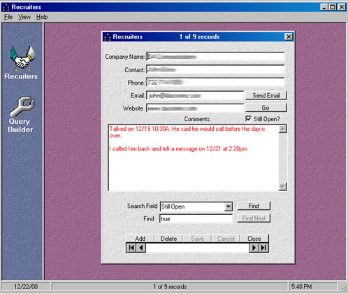



## A Recruiter organizer

### Description

This is an app to organize and keep track of the different recruiters that I have been dealing with looking for a new job. It stores all of your contacts in an access database, allows you to search on all fields, sort on Company Name or Contact. Allows you to send email or go to the recruiters website. This is my first submission to PSC. I would appreciate as much feedback as possible (Good or Bad),and some votes if you like my code.
 
### More Info
 

             |
---                |---
**Submitted On**   |2002-01-10 18:55:06
**By**             |[Rick B](https://github.com/Planet-Source-Code/PSCIndex/blob/master/ByAuthor/rick-b.md)
**Level**          |Intermediate
**User Rating**    |4.5 (59 globes from 13 users)
**Compatibility**  |VB 6\.0
**Category**       |[Databases/ Data Access/ DAO/ ADO](https://github.com/Planet-Source-Code/PSCIndex/blob/master/ByCategory/databases-data-access-dao-ado__1-6.md)
**World**          |[Visual Basic](https://github.com/Planet-Source-Code/PSCIndex/blob/master/ByWorld/visual-basic.md)
**Archive File**   |[A\_Recruite482501122002\.zip](https://github.com/Planet-Source-Code/rick-b-a-recruiter-organizer__1-13800/archive/master.zip)

